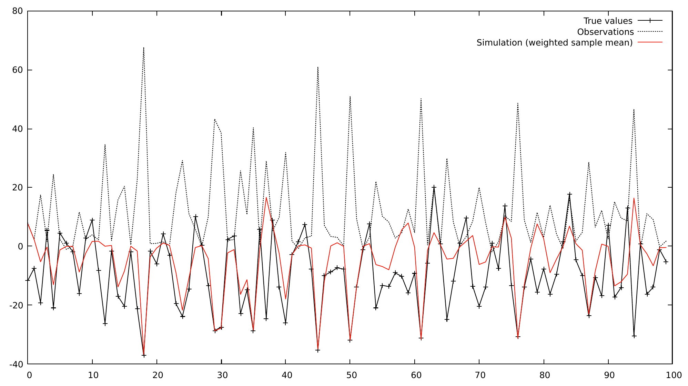

# SMCPF
This repository contains a templated header-only dependency-free Particle Filter library written in C++.

## Requirements
The library is written in C++17 and thus requires a C++17 compatible compiler, i.e. GCC 7 or newer/ Clang 5 or newer.
Some parts of the library can be configured to run in parallel by setting a preprocessor constant `PF_USE_PARALLEL` 
before including the header [particlefilter.hh](libs/smcpf/include/particlefilter.hh):
```cpp
#define PF_USE_PARALLEL
#include <particlefilter.hh>
```
This uses the C++ header `<execution>` which itself depends on [Intel's TBB Library](https://software.intel.com/en-us/tbb).
If the constant `PF_USE_PARALLEL` is not set, however, the library itself is completely dependency-free (i.e. depends only on the C++ standard library).

## Running the examples
The repository contains three examples located in the folder [apps](apps).
They can be easily compiled using [CMake](https://cmake.org/). Example 2 and 3
depend on third-party libraries. The first example can be used as-is.

### Example 1 (Simple nonlinear non-Gaussian example)
The first [example](apps/example1) does not have any dependencies. To
compile and run it, first clone the repository
```
git clone https://github.com/nilsfriess/ParticleFilter.git
```
and set up the `CMake` project. In the root directory of the cloned
repository, run
```
cmake -S . -B build
```
to generate the build files in the directory `build`. After that, `cd` into the `build` directory and
compile the example by running
```
make example1
```
The executable is saved to the folder `build/apps`. Before executing it, we have to provide a `.csv` file
containing the observations that the particle filter can then use. In the folder [data/example1](data/example1)
a Python script to generate test data is provided. A file that already contains sample observations is also
given there. The program expects the file to be located in the same folder from which it is called, so we copy the 
observation file [obs_ex1.csv](data/example1/obs_ex1.csv) to the `build` folder 
(assuming we are still inside the `build` folder)
```
cp ../data/example1/obs_ex1.csv .
```
We can now run the program
```
./apps/example1
```
The program writes its results to a file `output_ex1.csv`. A few exemplar plots of showing the initial data
and the simulated results can be found in the folder [data/example1](data/example1), e.g.



### Examples 2 and 3 (Lotka-Volterra equations, Predator-Prey model)
Setting up and running these examples is similar to above. However, these examples both
depend on third-party libraries that both programs get linked against, namely
* [LAPACK](http://www.netlib.org/lapack/)
* [Armadillo](http://arma.sourceforge.net/)
* [Intel TBB](https://software.intel.com/en-us/tbb)

Additionally, the header-only libraries [StatsLib](https://github.com/kthohr/stats) 
and [GCEM](https://github.com/kthohr/gcem) are required. They are both included in the
[apps/include](apps/include) folder.

After installing the missing dependencies, the programs can be compiled as above by running 
`make example2` and `make example3` inside the `build` directory. Again, an input file containing
the observations has to be provided. A sample file is provided as [obs.csv](data/example2/obs.csv).


